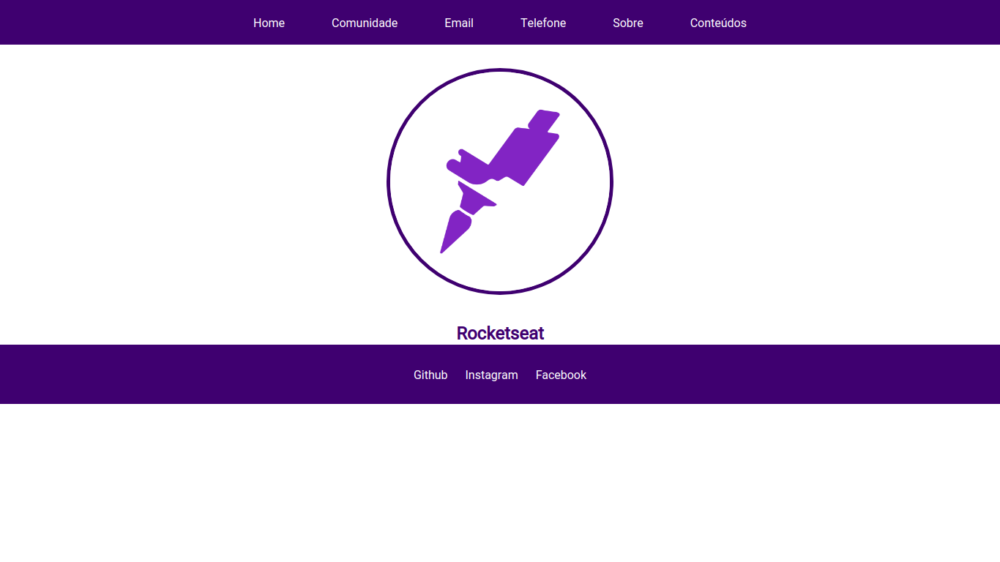
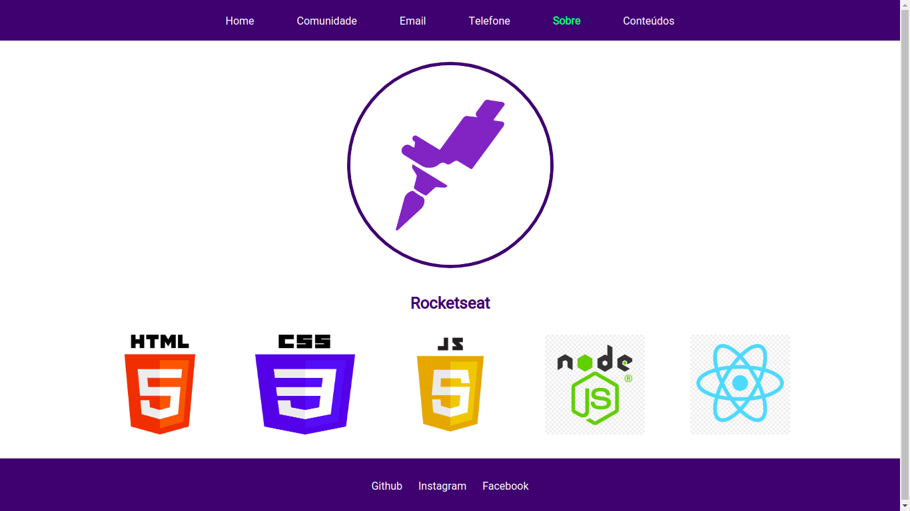
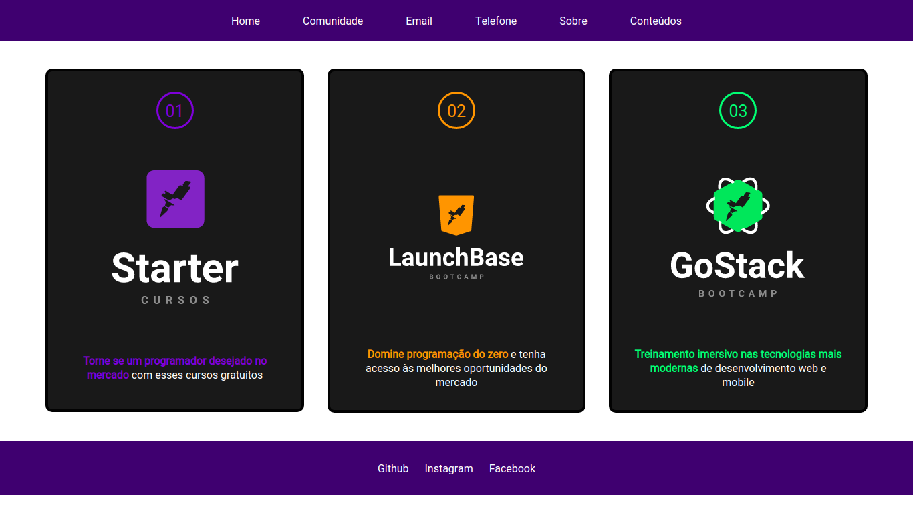
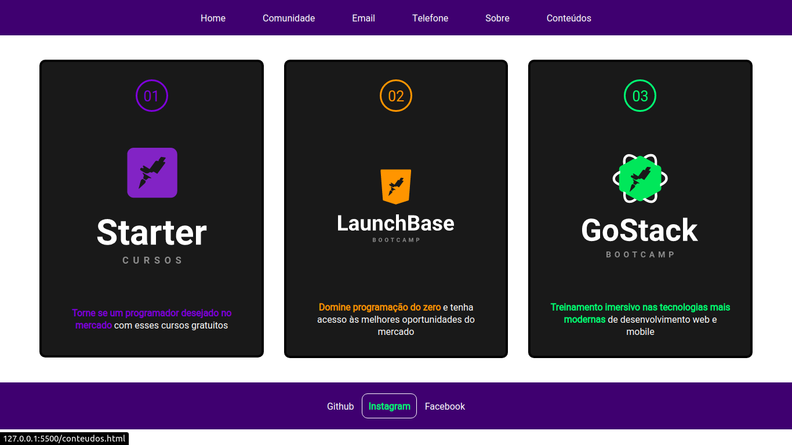

# Bootcamp Launch Base - Rocketseat

Projeto desenvolvido durante um Bootcamp da Rocketseat
Objetivo foi desenvolver um site que utiliza-se conceitos um pouco mais avançados sobre CSS e Javascript.

Na página Conteúdos temos cards que foram feitos utilizando CSS Grid Layout.
Cada card dessa página leva para uma modal onde acessamos um conteúdo especifico.

A modal tem a funcionalidade de maximizar que foi implementada utilizando javascript.

Abaixo as imagens do projeto.

